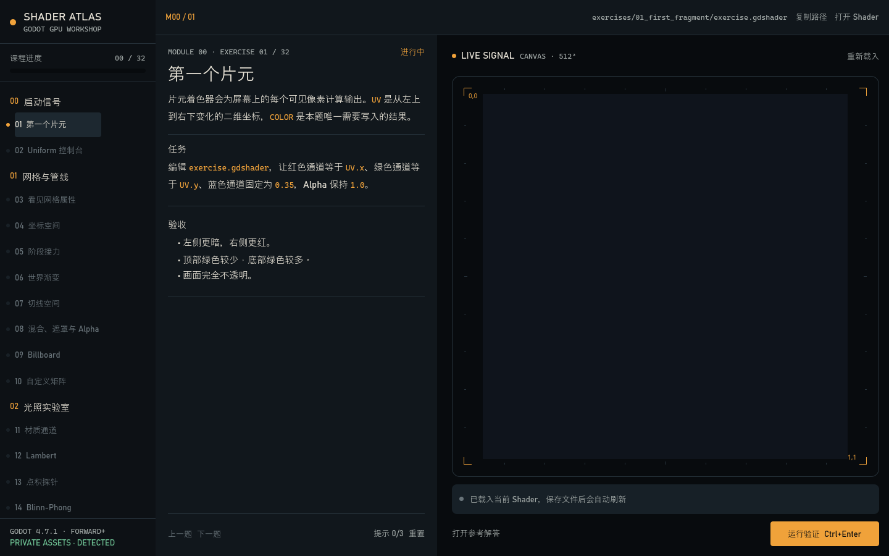

# Shader Atlas


[English documentation](README.md)

Shader Atlas 是一套 Godot 4.7.1 原生交互式 Shader 课程。课程目录的早期骨架参考了 [The Book of Shaders](https://thebookofshaders.com/) 从网格、光照到程序化效果和后处理的主题顺序；38 个主课练习和 9 个预科练习的讲义、代码、预览和验证均由本项目重新设计。练习系统还借鉴了 `100-exercises-to-learn-rust` 的短练习、独立解答和自动反馈结构。



## 开始使用

1. 使用 Godot 4.7.1 打开本目录中的 `project.godot`。
2. 按 F5 运行项目，主场景已经配置为 `workshop/main.tscn`。
3. 在左侧选择当前练习，阅读中间的任务与验收条件。
4. 点击“打开 Shader”，编辑对应的 `exercises/<id>/exercise.gdshader` 并保存。
5. Workshop 检测到文件变化后会自动刷新右侧实时预览。
6. 点击“运行验证”，通过后解锁下一题。

项目不依赖第三方插件，也不需要单独安装课程运行器。

## 交互

首次运行时会显示“指南”引导，说明三步工作流；之后也可随时从顶部工具栏重新打开。

| 操作 | 入口 |
|---|---|
| 重新打开 onboarding | 顶部工具栏“指南” |
| 切换界面语言 | 顶部工具栏“English” / “中文” |
| 运行验证 | `Ctrl+Enter` |
| 重置当前练习 | `Ctrl+R` |
| 重置全部课程 | 左侧栏“重置全部” |
| 切换开发者模式 | 左侧栏“DEV · OFF” |
| 揭示下一条提示 | `H` |
| 上一题 | `Alt+Left` |
| 下一题 | `Alt+Right` |
| 取消重置确认 | `Esc` |

切换语言会同时更新工作台界面、目录元数据、当前讲义、提示和人工观察清单。英文讲义与中文 `README.md` 并列存放，文件名为 `README.en.md`。

每题提供三级提示。当前练习与全局重置都需要二次确认；全局重置会先备份全部 38 题主课代码和 9 题预科代码及进度，再恢复 starter、清空完成记录与提示并回到第 1 题。备份位于 `user://shader_atlas/backups`。参考解答位于 `solutions/`，不会覆盖学习者文件。

## 课程结构

- 模块 0：片元输出与 uniform。
- 模块 1：网格属性、坐标空间、varying、切线空间与矩阵。
- 模块 2：材质通道、Lambert、Blinn-Phong、Fresnel、各向异性与法线。
- 模块 3：SDF、程序化角色、时间动画、顶点波、UI 扫光与四元数。
- 模块 4：后处理、Shadertoy 移植、透明度、光线步进与模板缓冲。
- 模块 5：组合顶点脉动、Fresnel 和溶解的综合挑战。
- 模块 6：可复现随机、Value Noise、Voronoi、fBm 与屏幕纹理 UV 扰动。
- 预科桥接：step/smoothstep、中心坐标、TIME 波形和 uniform 参数。

完整映射见 [课程蓝图](docs/CURRICULUM.md)，来源与私人使用边界见 [来源与改编方法](docs/SOURCES_AND_METHOD.md)。

## 内容参考

[The Book of Shaders](https://thebookofshaders.com/) 由 Patricio Gonzalez Vivo 与 Jen Lowe 编写，是一份循序渐进介绍 fragment shader 的指南。它从 shader 基础、uniform 和运行 shader 开始，延伸到算法绘图、生成式设计、图像处理、模拟与 3D 技术，影响了 Shader Atlas 早期的主题分组。本项目没有按章节逐章改编，讲义、练习、解答、预览和验证规则均针对 Godot 与私人使用场景重新编写。

## 验证方式

大多数练习会同时渲染学习者 Shader 和参考 Shader，再比较 64×64 降采样图像。无法仅凭单帧判断的接口使用源码契约，例如 ShaderInclude、uniform 和 stencil mode。依赖相机运动、透明排序或解释能力的练习还会显示人工观察清单。

验收不要求学习者照抄 solution。只要运行画面、必要接口和观察条件同时满足，就可以通过。

## 进度与私人素材

进度保存在 `user://shader_atlas/progress.json`。若文件损坏，程序会保留带时间戳的原始副本，然后建立新存档。

开发者模式只在当前运行期间解除关卡前置限制，允许直接跳转任意练习；它不会修改完成记录，也不会写入进度存档。

检测到 `res://assets_v17/assets` 时，左下角会显示 `PRIVATE ASSETS · DETECTED`。核心练习始终使用自带几何体和程序化夹具，因此移走该目录也不会破坏课程。

本项目按私人使用场景制作。请勿对外分发原书图片或其配套素材。

## 项目目录

```text
course/                 课程目录与验收配置
exercises/<id>/         讲义、当前练习和 starter 快照
solutions/              独立参考解答
shared/shaders/         ShaderInclude 与模板写入 Shader
workshop/               Godot 界面、课程会话、预览和验证运行时
tests/                  结构测试与真实 GPU 渲染测试
docs/                   课程、架构、来源和设计说明
```

界面规范见 [DESIGN.md](DESIGN.md)，运行时职责见 [架构说明](docs/ARCHITECTURE.md)，完整数据流见 [数据流文档](docs/DATA_FLOW.md)。

## 验证项目

结构测试：

```powershell
powershell.exe -NoProfile -ExecutionPolicy Bypass -File .\tests\validate_course.ps1
```

真实 GPU 测试分三批运行，避免一次保留过多渲染管线：

```powershell
godot --path . --rendering-driver d3d12 --script res://tests/shader_render_smoke.gd -- --from=1 --to=10
godot --path . --rendering-driver d3d12 --script res://tests/shader_render_smoke.gd -- --from=11 --to=20
godot --path . --rendering-driver d3d12 --script res://tests/shader_render_smoke.gd -- --from=21 --to=32
godot --path . --rendering-driver d3d12 --script res://tests/shader_render_smoke.gd -- --from=33 --to=38
```

每批都会确认 solution 通过视觉比较，并确认 starter 不会误通过。第 31 题使用模板契约与人工观察清单。
