# Shader Atlas 数据流

本文以数据如何在项目中流动为主线，说明课程资源、Godot Workshop、Shader 预览、验证、进度存档、重置恢复和自动测试之间的关系。

## 总体数据流

```mermaid
flowchart TD
    launch["project.godot<br/>run/main_scene"] --> scene["workshop/main.tscn"]
    scene --> app["WorkshopApp<br/>三栏工作台"]

    subgraph course_data["课程数据 res://"]
        main_catalog["course/catalog.json<br/>主课 32 题"]
        prep_catalog["course/prep_catalog.json<br/>预科 5 题"]
        main_checks["course/checks.json"]
        prep_checks["course/prep_checks.json"]
        lessons["README.md<br/>任务、验收、提示"]
        starters["starter.gdshader.txt<br/>重置快照"]
        sources["exercise.gdshader<br/>学习者工作文件"]
        solutions["solutions/<id>.gdshader<br/>参考渲染文件"]
        prep_sources["prep/exercises/<id>/exercise.gdshader"]
        prep_solutions["prep/solutions/<id>.gdshader"]
    end

    main_catalog --> repo["CourseRepository<br/>读取、索引、补全路径"]
    prep_catalog --> repo
    repo --> session["CourseSession<br/>当前轨道、题目、课程状态"]
    lessons --> parser["LessonParser<br/>Markdown → 讲义结构"]
    parser --> session
    main_checks --> registry["ValidationRegistry<br/>规则、阈值、契约"]
    prep_checks --> registry
    sources --> workspace["ShaderWorkspace<br/>打开、读取、重载、备份"]
    prep_sources --> workspace
    starters --> workspace
    solutions --> reference_source["主课参考 Shader"]
    prep_solutions --> prep_reference_source["预科参考 Shader"]
    reference_source --> workspace
    prep_reference_source --> workspace

    progress_file[("user://shader_atlas/progress.json")]
    backup_dir[("user://shader_atlas/backups/")]
    progress_file --> progress["ProgressStore<br/>当前题、完成项、提示数、轨道"]
    progress --> session
    session -->|选择 main / prep| app
    app -->|导航、讲义、状态| user["学习者"]

    user -->|点击题目 / Alt+方向键| app
    app -->|select_exercise / select_prep_exercise| session
    session -->|entry + lesson + shader| app
    app -->|当前 Shader + preview 类型| live_preview["CalibratedPreview<br/>实时可视预览"]
    app -->|参考 Shader| reference_preview["Reference Fixture<br/>参考画面"]
    app -->|当前 Shader| validation_fixture["Learner Validation Fixture<br/>验证专用画面"]

    user -->|外部编辑器保存 Shader| sources
    user -->|外部编辑器保存预科 Shader| prep_sources
    sources -->|时间戳变化| workspace
    prep_sources -->|时间戳变化| workspace
    workspace -->|poll_external_change / reload_current| session
    session -->|source_external_changed| app
    app -->|replace_shader| live_preview
    app -->|replace_shader| validation_fixture

    live_preview -->|画面、鼠标拖拽| user
    live_preview -->|空间题相机旋转| camera["PreviewFixture 相机状态"]
    camera -.->|不进入验证状态| validation_fixture

    user -->|Ctrl+Enter / 运行验证| validate["WorkshopApp._run_validation"]
    validate -->|读取当前轨道规则| registry
    validate -->|固定帧数后截图| validation_fixture
    validate -->|固定参考截图| reference_preview
    validation_fixture --> actual["学习者 Image"]
    reference_preview --> expected["参考 Image"]
    actual --> compare["compare_images<br/>64×64 降采样与误差统计"]
    expected --> compare
    workspace -->|当前源码| contracts["check_contracts<br/>必要时检查源码契约"]
    app -->|人工勾选| manual["manual_checklist"]
    compare --> combine["combine_results<br/>视觉 + 契约 + 人工"]
    contracts --> combine
    manual --> combine
    combine -->|失败| app
    combine -->|通过| complete["mark_complete(current_track)"]
    complete --> progress
    progress -->|解锁下一题、更新计数| app

    user -->|提示 H| hint["reveal_hint"]
    hint --> progress
    progress -->|可见提示数量| parser

    user -->|当前重置 / 全局重置| reset["CourseSession reset"]
    reset -->|先写入备份| backup_dir
    reset -->|恢复 starter| workspace
    reset -->|清空 main / prep 进度| progress
    reset -->|重新打开首题| session

    subgraph quality["工程质量与发布"]
        course_test["tests/validate_course.ps1<br/>目录、文件、题面、数值目标"]
        control_test["tests/course_controls_smoke.gd<br/>进度、轨道、相机、验证隔离"]
        render_test["tests/shader_render_smoke.gd<br/>主课 / 预科渲染烟测"]
        git["Git commit"]
        github["GitHub main<br/>SSH origin"]
    end
    course_test -->|读取主课资源| main_catalog
    course_test -->|读取预科资源| prep_catalog
    course_test -->|读取验证规则| main_checks
    course_test -->|读取预科规则| prep_checks
    control_test -->|驱动运行时对象| session
    render_test -->|读取 Shader 与验证规则| registry
    course_test --> git
    control_test --> git
    render_test --> git
    git -->|git push via SSH| github

    classDef store fill:#172027,stroke:#70c697,color:#e7e2d6;
    classDef runtime fill:#11171c,stroke:#f0a23a,color:#e7e2d6;
    classDef input fill:#0d1115,stroke:#a3aaa8,color:#e7e2d6;
    classDef output fill:#080b0e,stroke:#df7466,color:#e7e2d6;
    class progress_file,backup_dir store;
    class app,repo,session,parser,workspace,registry,live_preview,reference_preview,validation_fixture,compare,combine runtime;
    class user,sources,prep_sources input;
    class github output;
```

## 关键数据边界

### 主课与预科

主课和预科共用 `CourseRepository`、`CourseSession`、预览和验证界面，但数据轨道独立：

- 主课读取 `course/catalog.json`，使用 `exercises/`、`solutions/` 和主课进度键。
- 预科读取 `course/prep_catalog.json`，使用 `prep/exercises/`、`prep/solutions/` 和 `prep_*` 进度键。
- 两条轨道共享操作方式，但前置题、完成计数、提示数量和当前题目不会互相污染。

### 可视预览与验证预览

右侧实时预览允许用户旋转空间题相机，因此它是交互状态。验证使用独立的 `Learner Validation Fixture` 和 `Reference Fixture`，在固定配置下重新渲染并截图，避免用户改变相机位置后让原验证基准失效。

### 学习文件与参考文件

学习者只写入 `exercise.gdshader`。`starter.gdshader.txt` 只用于重置，`solutions/<id>.gdshader` 和 `prep/solutions/<id>.gdshader` 只用于参考渲染与主动查看，不会覆盖学习者文件。

### 存档与恢复

`ProgressStore` 将当前题目、轨道、已完成题目和提示数量写入 `user://shader_atlas/progress.json`。重置前 `ShaderWorkspace` 先把源代码写入 `user://shader_atlas/backups/`，再恢复 starter；全局重置失败时会尝试从同一批备份回滚。

## 相关入口

- 启动入口：`project.godot` → `workshop/main.tscn` → `workshop/workshop_app.gd`
- 课程索引：`workshop/course_repository.gd`
- 运行时编排：`workshop/course_session.gd`
- 文件与备份：`workshop/shader_workspace.gd`
- 预览与相机：`workshop/preview_fixture.gd`、`workshop/calibrated_preview.gd`
- 验证：`workshop/validation_registry.gd`
- 进度：`workshop/progress_store.gd`
- 自动校验：`tests/validate_course.ps1`、`tests/course_controls_smoke.gd`、`tests/shader_render_smoke.gd`
